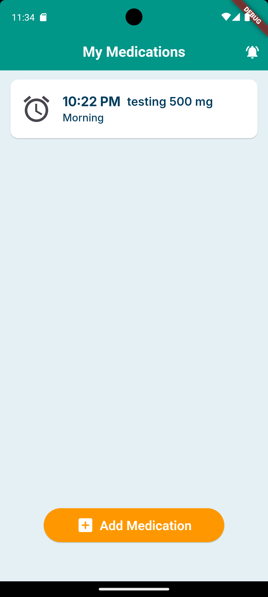
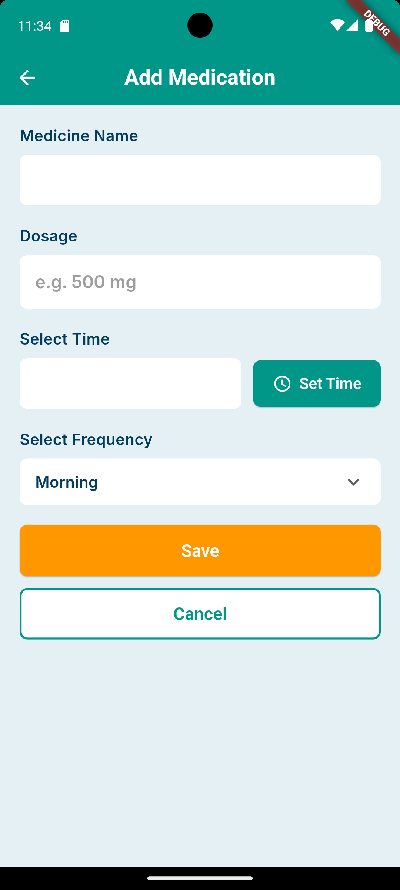
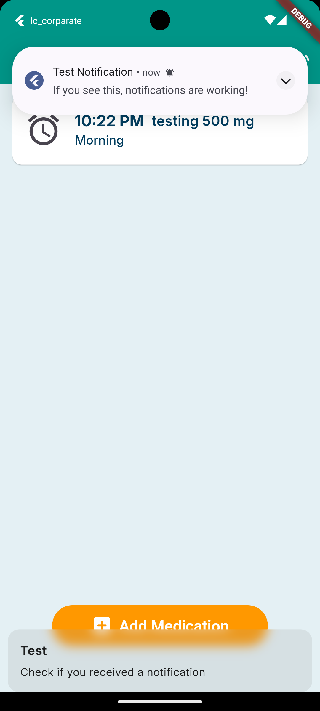

# 💊 Medicine Reminder App

<div align="center">


**Never miss your medication again!** 🎯

A simple, beautiful, and reliable medicine reminder app built with Flutter.

[Features](#-features) • [Screenshots](#-screenshots) • [Installation](#-installation) • [Tech Stack](#-tech-stack) • [Contributing](#-contributing)

</div>

---

## ✨ Features

### 📱 Core Functionality

- **Smart Reminders** - Set daily medication reminders that work even when the app is closed
- **Easy Management** - Add, view, and delete medications with a clean, intuitive interface
- **Time-Sorted Display** - Medications automatically sorted by time of day
- **Swipe to Delete** - Quick and easy medication removal with confirmation
- **Persistent Storage** - Your medications are saved locally and persist across app restarts

### 🔔 Notification System

- ✅ Daily repeating alarms at scheduled times
- ✅ Works when app is in background
- ✅ Works when phone is locked
- ✅ Survives phone restarts
- ✅ Full-screen notifications on lock screen
- ✅ Custom notification sound and vibration

### 🎨 User Experience

- Clean and modern UI design
- Smooth animations and transitions
- Empty state with helpful messaging
- Real-time validation and error handling
- 12-hour time format with AM/PM
- Frequency selection (Morning, Afternoon, Evening, Night)

---

## 📸 Screenshots

<div align="center">

|                 Home Screen                 |                 Add Medication                  |                     Reminders                      |
| :-----------------------------------------: | :---------------------------------------------: | :------------------------------------------------: |
|  |  |  |
|         _View all your medications_         |             _Set up new reminders_              |             _Get timely notifications_             |

</div>

---

## 🚀 Installation

### Prerequisites

- Flutter SDK (3.5.4 or higher)
- Dart SDK (3.5.4 or higher)
- Android Studio / VS Code
- Android device or emulator (API 21+)

### Setup Steps

1. **Clone the repository**

   ```bash
   git clone https://github.com/yourusername/medicine-reminder.git
   cd medicine-reminder
   ```

2. **Install dependencies**

   ```bash
   flutter pub get
   ```

3. **Run the app**
   ```bash
   flutter run
   ```

---

## 🛠️ Tech Stack

### Framework & Language

- **Flutter** - UI framework for cross-platform development
- **Dart** - Programming language

### State Management

- **GetX** - Lightweight and powerful state management solution

### Local Storage

- **SharedPreferences** - For persistent data storage

### Notifications

- **flutter_local_notifications** - Local notification scheduling
- **timezone** - Timezone handling for accurate scheduling
- **permission_handler** - Runtime permission management

### Design & UI

- **Material Design 3** - Modern UI components
- **Custom Theme** - Teal and orange color scheme
- **Inter Font Family** - Clean and readable typography

---

## 📂 Project Structure

```
lib/
├── app/
│   ├── data/
│   │   ├── local/          # Local storage
│   │   ├── models/         # Data models
│   │   └── theme/          # App themes and colors
│   ├── routes/             # Navigation routes
│   └── services/           # Notification service
├── modules/
│   ├── add_medicine/       # Add medication screen
│   │   ├── controllers/
│   │   └── views/
│   └── home/               # Home screen
│       ├── controllers/
│       └── views/
├── widgets/                # Reusable widgets
└── main.dart              # App entry point
```

---

## 🎯 How to Use

1. **Add a Medication**

   - Tap the "Add Medication" button
   - Enter medicine name and dosage
   - Set the reminder time
   - Choose frequency (Morning/Afternoon/Evening/Night)
   - Tap "Save"

2. **View Medications**

   - All medications displayed on home screen
   - Sorted by time (earliest first)

3. **Delete a Medication**
   - Swipe left on any medication card
   - Confirm deletion
   - Notification is automatically cancelled

---

## 🔐 Permissions

The app requires the following permissions:

- **Notifications** - To send medication reminders
- **Exact Alarms** - For precise timing
- **Boot Completed** - To restore reminders after restart
- **Wake Lock** - To wake device for notifications

---

## 🐛 Known Issues & Limitations

- Currently supports single daily reminder per medication
- Timezone set to Asia/Kolkata (can be modified in `notification_service.dart`)
- iOS implementation pending

---

## 🤝 Contributing

Contributions, issues, and feature requests are welcome!

1. Fork the project
2. Create your feature branch (`git checkout -b feature/AmazingFeature`)
3. Commit your changes (`git commit -m 'Add some AmazingFeature'`)
4. Push to the branch (`git push origin feature/AmazingFeature`)
5. Open a Pull Request

---

## 📝 License

This project is licensed under the MIT License - see the [LICENSE](LICENSE) file for details.

---

## 👨‍💻 Author

**Your Name**

- GitHub: [@mrjay45](https://github.com/mrjay45)
- LinkedIn: [jay raut](https://www.linkedin.com/in/jay-raut-5821a2244/)

---

## 🙏 Acknowledgments

- Flutter team for the amazing framework
- GetX community for the state management solution
- All contributors and supporters

---

<div align="center">

**Made with ❤️ and Flutter**

⭐ Star this repo if you found it helpful!

</div>
